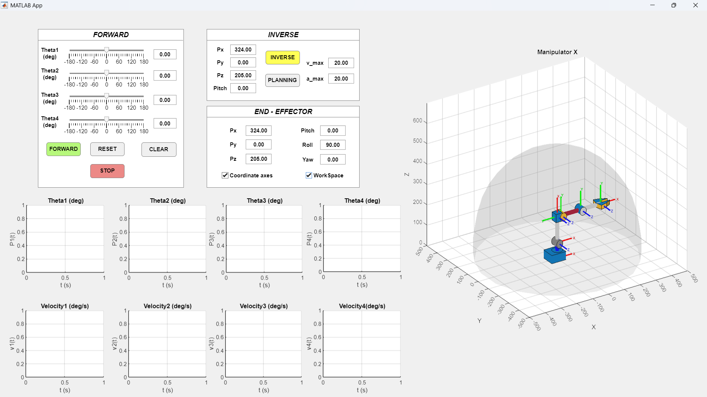

# 🤖 Manipulator-X: 4-DOF Robot Arm Simulation

**Manipulator-X** is a GUI-based simulation tool for a 4-Degree-of-Freedom (4-DOF) robotic arm, developed using **MATLAB App Designer**.

## 🔗 Hardware Reference (ROBOTIS)

This software simulates the **OpenManipulator-X**, a widely used open-source robotic arm developed by **ROBOTIS**.

* **Official Product Page:** [ROBOTIS OpenManipulator-X](https://emanual.robotis.com/docs/en/platform/openmanipulator_x/overview/)

This project provides a comprehensive environment to visualize and analyze robotic movements, featuring **Forward/Inverse Kinematics (FK/IK)**, **Workspace visualization**, and **LSPB Trajectory Planning** with real-time velocity/acceleration graphs.

## 🌟 Key Highlights:
* Interactive 3D control & animation.
* Smart IK solver with Backward Reach capability.
* Smooth trajectory generation (Trapezoidal Velocity).
* Safety checks (Singularity, Collision, Limits).

## 🖥️ Main Interface
 

## ⚠️ Disclaimer 

 This project is a student assignment created for educational purposes. The code may contain bugs, is not fully optimized, and the calculations may not be absolutely precise. Use at your own risk.

